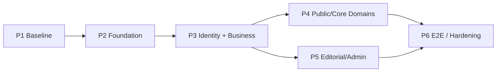

# Application Implementation Plan v1

**Status:** P1–P6 completed — **Application v1 release-ready for final review/commit**
**Depends on:** `application-architecture-v1.md`, Access/RLS v1 closed (`v0.3.0-db-access-rls-v1`)
**Constraint:** No DB migrations / RLS changes in P2–P6 unless a separate DB cycle is explicitly opened.
**Next step:** final human review → commit/push (not performed in P6).
**P3 report:** `p3-identity-business-workspace-validation-report.md`
**P4 report:** `p4-public-core-domains-validation-report.md`
**P4.5 report:** `p4.5-ecosystem-ux-information-architecture-validation-report.md`
**P5 report:** `p5-editorial-admin-validation-report.md`
**P6 report:** `p6-e2e-hardening-release-validation-report.md`
**Public IA:** five ecosystems (Persone, Imprese, Opportunità/Collaborazioni, Mercati, Servizi) + transversal layers; see `src/data/ecosystems.ts`.

---

## 1. Goal

Build a usable application on the existing Next.js shell and the published Supabase schema:

- authenticate and resolve Account/Persona;
- operate Persona + Impresa workspace with CTX ≠ ACT;
- expose public discovery for core domains;
- separate Redazione and Amministrazione (Adm ≠ Red);
- harden with E2E and negative authorization.

Avoid 100 micro-tickets. Execute **macro-blocks P2→P6**.

---

## 2. Current baseline (P1 facts)

| Fact | Evidence |
|---|---|
| Public demo shell | `src/app/page.tsx` + `src/data/home/*` |
| Domain routes mostly EmptyState | `src/app/*/page.tsx` + `SectionPage` |
| Supabase clients unused | `src/lib/supabase/{client,server}.ts` |
| No auth/middleware/RPC usage | inventory |
| Broken `/accedi` link | `src/data/navigation.ts` |
| No tests / CI workflows | `package.json`, no `.github/workflows` |
| DB/RLS ready | head `20260812300000` |

---

## 3. Priority buckets

### B0 — Bloccanti (must clear before/at start of P2)

| Gap | Why |
|---|---|
| No session/middleware | Cannot protect reserved routes |
| No Account provisioning path | Signup cannot meet Access contract (`access_provision_account` is service_role) |
| Broken `/accedi` | Entry CTA dead |
| Risk of service-role in client | Security (currently absent — keep it that way) |

### B1 — Foundation

| Gap | Why |
|---|---|
| Application session object | Auth≠Account≠Persona for UI |
| Onboarding Persona/profile | Reach `active` Account |
| App shell reserved layout | Navigation by real permissions |
| Error/loading/forbidden patterns | Consistent UX on RLS denies |
| Typed data-access starters | Stop ad-hoc queries later |

### B2 — Core product

| Gap | Why |
|---|---|
| Profile self + public person | Identity surface |
| Business CTX/ACT workspace | Core network value |
| Public list/detail for primary domains | Portal value |
| Owned create/edit (Persona/ACT) | Contribution loops |
| Red editorial + Adm admin UIs | Separated powers |

### B3 — Polish / post-v1

| Gap | Why |
|---|---|
| Advanced search/filters | After basic discovery |
| Rich media/Storage | Needs product + possibly DB |
| Training domain UI | DB quarantine remains |
| Org membership graphs / matching / consents | Explicitly out of Access v1 |
| Visual redesign | Shell tokens sufficient for v1 |
| Full CI matrix | Add after E2E baseline exists |

---

## 4. Macro-blocks

Dependencies are acyclic: P5 does not require full P4 coverage, but both require P3 session/CTX/ACT. P6 requires P2–P5 critical paths.

---

## 5. P2 — Application Foundation

**Objective:** Make Auth + Account + Persona session real; stop being a static shell.

### Deliverables

1. Supabase SSR wired: middleware session refresh; browser + server clients used.
2. Auth pages: `/accedi`, `/registrati` (and reset if product-ready).
3. Trusted **server** provisioning calling `access_provision_account` (service role never in bundle).
4. Application session resolver (`authUserId`, `accountId`, `accountStatus`, `personId`, `isEditor`, `isApplicationAdmin`).
5. Onboarding: link/create Persona + profile completion gate toward `active`.
6. Reserved app shell layout (e.g. `/app/*`) with protected routing.
7. Shared UI states: loading / empty / unauthorized / forbidden / error.
8. Replace dead Accedi CTA; hide reserved nav until authorized.

### Exit criteria

- Signup → Account row exists without automatic Persona/roles/grants.
- Session distinguishes missing Account vs inactive vs active+Persona.
- Unauthenticated users cannot open reserved routes.
- No service-role key in client bundle.

### Non-goals

- Full domain CRUD
- Redesign
- Adm/Red consoles (stubs ok)

---

## 6. P3 — Identity + Business Workspace

**Objective:** Operational Persona and Impresa with CTX ≠ ACT.

### Deliverables

1. Profile self view/edit respecting column grants; public person detail if policy allows.
2. “Le mie imprese” (CTX) vs “Imprese gestibili” (ACT).
3. Business switcher (UI context).
4. ACT-only business edit surfaces.
5. Membership list/lifecycle actions allowed by RLS (no direct authorization table writes).
6. Management grant/revoke via RPC (`grant_business_management` / `revoke_business_management`); Adm bootstrap via `access_bootstrap_business_grant`.
7. Descriptive membership role never unlocks management UI alone.

### Exit criteria

- Member without grant: CTX true, ACT controls hidden/disabled and server denies writes.
- Manager with grant: can mutate allowed business fields.
- No self-grant path in UI.

### Non-goals

- Full MI/Servizi/Eventi product depth (start in P4)
- Editorial consoles

---

## 7. P4 — Public / Core Domains

**Objective:** Cumulative public discovery + principal owned create/edit.

Implement in vertical slices (list → detail → owned mutate), not one domain per endless micro-PR.

### Priority slices (suggested order)

1. **Imprese** public list/detail (replace demo fixtures gradually)
2. **Professionisti** public + owner edit
3. **Opportunità** public + owned/party flows per schema
4. **Servizi** (offers/requests) with XOR owner + ACT rules
5. **Eventi** public + owner/ACT; participation ≠ management
6. **Collaborazioni** public + ternaria ownership (Persona/Impresa; Red later in P5)
7. **Mercati internazionali** presence/interest owned surfaces
8. Wire home sections to real public queries (remove or fence demo data)

### Domain sheet (planning)

| Dominio | Public list | Detail | Create | Edit | Dashboard | Stato attuale |
|---|---|---|---|---|---|---|
| Persone | optional directory | yes | via onboarding | self | profile | self in `/app` (no public directory) |
| Imprese | yes | yes | later/controlled | ACT | workspace | **P4 public list/detail** |
| Appartenenze | no public graph | membership UX | self/ACT rules | limited | under Impresa | workspace P3 |
| Mercati Internazionali | selective | yes | OwnP/ACT | OwnP/ACT | workspace | **P4 `/mercati`** (redirect da `/lingue-e-mercati`) |
| Professionisti | yes | yes | owner Persona | owner | workspace | **P4 public list/detail** |
| Opportunità | yes | yes | per contract | per contract | workspace | **P4 public list/detail** |
| Servizi | yes | yes | OwnP/ACT | OwnP/ACT | workspace | **P4 offerte/richieste** |
| Eventi | yes | yes | OwnP/ACT | OwnP/ACT | workspace | **P4 list/detail + edizioni** |
| Contenuti | yes | yes | Red (P5) | Red (P5) | Red | **P4 lettura pubblica** |
| Organizzazioni | selective | yes | OwnP/ACT/editorial | same | limited | **P4 list/detail** |
| Identità & Accessi | no | account settings | provision | RPC | account/Adm | P2/P3 |
| Collaborazioni | yes | yes | OwnP/ACT/(Red P5) | same | workspace | **P4 list/detail (slug)** |
| Osservatorio | yes | indicator/values | Red (P5) | Red (P5) | Red | **P4 indicatori/valori** |

### Exit criteria

- At least Imprese + one owned contribution domain + one discovery domain read from DB under RLS.
- Home no longer the only “content”, or demo clearly isolated.
- Client does not bypass RPC for Account/role/grant writes.

---

## 8. P5 — Editorial / Admin — **COMPLETED**

**Objective:** Separate Redazione and Amministrazione.
**Report:** `p5-editorial-admin-validation-report.md`
**Smoke:** `npm run test:p5-smoke` → `P5_SMOKE_PASS`.

### Deliverables

1. **Red** console: Contenuti CRUD per policy; Osservatorio indicators/sources/values per policy; editorial Org where `owned_by_editorial`.
2. **Adm** console: assign/revoke roles; bootstrap business grant; account close/support tools.
3. Navigation guards: Adm without Red never sees editorial write IA.
4. Audit-friendly confirmations (no new audit tables required).

### Exit criteria (met)

- Automated proof: Adm-only cannot create editorial Content/OSS rows (P5 smoke).
- Red-only cannot assign application roles (P5 smoke + unit policy).
- Red+Adm sees union, not collapsed “superuser” IA (`navFlags` + guards).

---

## 9. P6 — E2E / Hardening / Release — **COMPLETED**

**Objective:** Make the v1 app releasable.
**Report:** `p6-e2e-hardening-release-validation-report.md`
**E2E:** `npm run test:e2e` → 27/27 chromium; mobile viewport project green.

### Deliverables (met)

1. Playwright E2E (local Supabase): auth, Persona/Business CTX/ACT, Adm≠Red, public IA, Red create, negatives.
2. Responsive smoke (mobile/tablet viewport).
3. Accessibility base (h1, labels, focus-visible, error association).
4. Performance sanity: pagination/limits; home `Promise.all`.
5. Env checklist (`env.example`); secret scan clean; lint/typecheck/build green.
6. Demo home fixtures removed.

### Exit criteria (met)

- Critical E2E green against Access/RLS v1.
- No B0 open.
- Release report maps to architecture + this plan.

---

## 10. Cross-cutting standards (all blocks)

| Topic | Standard |
|---|---|
| Authorization UX | Hide when possible; always handle server `42501` |
| Grants/roles | RPC only |
| Ownership switches | Impossible; show immutable owners |
| Forms | One pattern from P2 onward |
| Naming routes | Italian public URLs may stay; reserved `/app` English-ok if consistent |
| Dependencies | Do not mass-upgrade in feature blocks; isolate upgrades |
| DB changes | Forbidden here without new DB cycle |

---

## 11. Suggested execution mode (accelerated)

| Block | Mode |
|---|---|
| P2 | Single foundation slice to first protected `/app` + onboarding |
| P3 | Single workspace slice CTX/ACT proven |
| P4 | Cumulative verticals; stop when core portal usable |
| P5 | Parallelizable after P3 session/roles available |
| P6 | Hardening gate before marketing “v1 app” claim |

Do not open P4/P5 until P2 exit criteria pass.

---

## 12. Explicit non-actions for upcoming blocks

- No Access/RLS redesign
- No training Access policies
- No Org membership model
- No collaboration matching engine
- No observatory ETL/microdata
- No broad visual rebrand

---

## 13. Decision after P1

P1 documents the baseline and authorizes **P2 Application Foundation** only.
