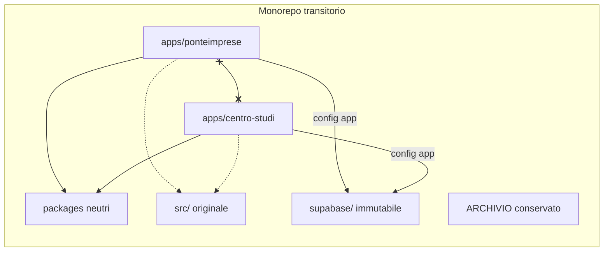

# SPLIT-2A — Architettura fisica target dei due prodotti

Documento ricostruito in SPLIT-2A-RECOVERY. Fonte autoritativa per le onde SPLIT-2B. Unità solo documentale: nessuna migrazione, estrazione o trasferimento è stato eseguito.

Le etichette operative storiche `G1`–`G5`, `G4=15` e `W2.1=18` **non** sono vincoli autoritativi e non sono usate in questo documento.

## 1. Decisione esecutiva

**Transitorio (SPLIT-2):** un unico monorepo Git con due applicazioni Next.js indipendenti (`apps/ponteimprese`, `apps/centro-studi`) e package tecnici neutrali in `packages/*`. Lo scaffold già presente al commit `f61613361b7bde9ae48109d9a472e5230fc8e243` è lo stato corrente da conservare, non da rifare.

**Target (post-SPLIT-2, estrazione repository):** due repository derivati dalla stessa storia, dopo tag di split e GO umano, come proposto da SPLIT-1 §20. Non è un obbligo di SPLIT-2.

**Database:** in SPLIT-2 resta un solo progetto Supabase, con configurazioni applicative separate. La separazione fisica dei database è SPLIT-3 (SPLIT-1 §19; piano esecutivo, sezione Supabase transitoria).

**Blocker tecnico concreto:** dalle fonti autoritative non emerge un blocker che impedisca il monorepo transitorio. La decisione è quindi confermata.

## 2. Stato corrente

| Campo | Valore |
|---|---|
| Branch | `main` |
| HEAD di riferimento | `f61613361b7bde9ae48109d9a472e5230fc8e243` |
| Sorgente originale | `src/`, `scripts/`, `supabase/` ancora presenti e non trasferiti |
| Shell app | `apps/ponteimprese`, `apps/centro-studi` (Next 16.2.10, React 19.2.4) |
| Package scaffold | `@immigrati/product-config`, `@immigrati/ui-foundation` |
| Workspace npm | `apps/*`, `packages/*` in `package.json` root |
| Inventario SPLIT-1 | invariato: 713 file, 1.959 oggetti |

File introdotti o modificati da `f616133` (18 path; non fanno parte del censimento 713):

- `apps/ponteimprese/` — `package.json`, `next.config.ts`, `tsconfig.json`, `src/app/{layout,page,globals.css}.tsx|css`
- `apps/centro-studi/` — stesso insieme
- `packages/product-config/{package.json,src/index.ts}`
- `packages/ui-foundation/{package.json,src/index.tsx}`
- root `package.json`, `package-lock.json`

Deviazione nota dello scaffold (gate, non correzione in questa unità): `packages/product-config` espone token di brand e copy di navigazione. Il piano esecutivo vieta brand nei package. La correzione (spostare brand/copy nelle app) è rinviata al gate `S2-GATE-BRAND` e non altera i conteggi 713.

## 3. Classificazione autoritativa 713

Fonte: `split-1-file-inventory.csv` e `split-1-product-allocation.md` §6. Verifica: `390 + 115 + 123 + 85 = 713`.

| Categoria | File | Trattamento SPLIT-2 |
|---|---:|---|
| `PONTE_IMPRESE` | 390 | Trasferire in `apps/ponteimprese` (esclusa catena SQL, immutabile) |
| `CENTRO_STUDI` | 115 | Trasferire in `apps/centro-studi` (esclusa catena SQL, immutabile) |
| `CONDIVISO` | 123 | Estrarre solo se neutro, oppure duplicare secondo modalità |
| `ARCHIVIO` | 85 | Conservare; zero cancellazioni |

`CONDIVISO` per modalità (`split-1-file-inventory.csv`, colonna modalità, filtro `categoria=CONDIVISO`):

| Modalità | File |
|---|---:|
| `DUPLICAZIONE_CONTROLLATA` | 73 |
| `SCHEMA_TEMPLATE_DUPLICATO` | 28 |
| `PACKAGE_VERSIONATO` | 22 |
| **Totale** | **123** |

Oggetti/occorrenze (`split-1-object-inventory.csv`): `PONTE_IMPRESE` 499, `CENTRO_STUDI` 487, `CONDIVISO` 969, `ARCHIVIO` 4 → **1.959**.

Identità di prodotto (SPLIT-1 §4 e prompt SPLIT-2A):

- **PonteImprese** — piattaforma B2B; dominio previsto `ponteimprese.com`.
- **Immigrati Imprenditori — Centro Studi sull’Imprenditoria Migrante** — ricerca, dati, fonti, pubblicazioni, storie, cultura, eventi. L’Osservatorio è sezione interna, non prodotto autonomo. Dominio previsto: dominio attuale del sito (nello scaffold: `immigratiimprenditori.it`).

## 4. Confronto delle alternative repository

| Alternativa | Esito | Motivo |
|---|---|---|
| Due repository immediati | Scartata per SPLIT-2 | SPLIT-1 §20 colloca l’estrazione dopo tag e GO; il piano esecutivo attua prima il monorepo |
| Un’unica app con feature flag | Scartata | Contrasta i confini obbligatori (deploy, SEO, identità, auth) |
| Monorepo con due app e package neutri | **Adottata (transitorio)** | Compatibile con lo scaffold `f616133` e con il piano esecutivo |
| Estrazione repository dopo verifica delle due app | **Target** | SPLIT-1 §20; richiede tag, manifest di provenienza e GO |

## 5. Struttura repository transitoria

Allineata al piano esecutivo e allo scaffold esistente. I nomi package dello scaffold (`product-config`, `ui-foundation`) restano; i nomi del piano (`core`, `contracts`, `ui-primitives`, `tooling-config`) sono **target di package**, da raggiungere con onde successive senza rifare le shell.

```text
.
├── apps/
│   ├── ponteimprese/          # già scaffoldata
│   └── centro-studi/          # già scaffoldata
├── packages/
│   ├── product-config/        # già scaffoldata; brand da rimuovere (gate)
│   ├── ui-foundation/         # già scaffoldata; destinazione primitive UI
│   ├── core/                  # da creare in onda utility, se servono file neutri
│   ├── contracts/             # da creare per tipi/contratti versionati
│   └── tooling-config/        # da creare o assorbire in duplicazione toolchain
├── docs/
│   ├── architecture/
│   ├── reconciliation/
│   └── archive/               # destinazione documentale ARCHIVIO (senza cancellare origini)
├── scripts/                   # transitorio; poi per-app o tecnici
├── supabase/                  # catena storica immutabile in SPLIT-2
└── src/                       # sorgente originale fino a verifica finale
```

## 6. Struttura target (estrazione repository)

Dopo completamento SPLIT-2 e GO:

1. Tag di split sul monorepo.
2. Repository A: storia completa, brandizzato PonteImprese; rimozione del perimetro Centro Studi solo con GO dedicato.
3. Repository B: derivato per Centro Studi; rimozione del perimetro Ponte solo con GO dedicato.
4. Manifest di provenienza in entrambi.
5. `supabase/` storico resta nel monorepo/originario finché SPLIT-3 non genera baseline nuove.

## 7. Due applicazioni

| | PonteImprese | Centro Studi |
|---|---|---|
| Directory | `apps/ponteimprese` | `apps/centro-studi` |
| Package npm | `@immigrati/ponteimprese` | `@immigrati/centro-studi` |
| Dominio previsto | `ponteimprese.com` | dominio attuale |
| Route da inventario | tutte le `page.tsx` allocate `PONTE_IMPRESE` | tutte le `page.tsx` allocate `CENTRO_STUDI` |
| Osservatorio | assente come prodotto | sezione interna |

Le sotto-aree redazionali seguono l’inventario per path, non una regola `redazione/**`: `src/app/app/redazione/eventi/**` → Centro Studi (`S2-CS-APP-01`); `src/app/app/redazione/mercati-internazionali/**`, `src/app/app/redazione/opportunita/**`, `src/app/app/redazione/organizzazioni/**` → PonteImprese (`S2-PI-APP-01`). Contenuti, Osservatorio e indice redazione restano CS se così classificati.

Nessuna app importa moduli interni dell’altra. `src/app/lingue-e-mercati/page.tsx` è `CONDIVISO`: non è di default in una sola app; l’onda `S2-COND-LIB-01` decide duplicazione o contratto. `src/app/organizzazioni/[slug]/page.tsx` è `PONTE_IMPRESE` (onda `S2-PI-APP-01`). `src/app/organizzazioni/loading.tsx` resta `CONDIVISO` (stessa onda `S2-COND-LIB-01`) con gate `S2-GATE-ORG-LOADING`: non assegnarlo a PonteImprese senza verifica del comportamento route/layout. `src/app/eventi/page.tsx` e `src/app/eventi/[id]/page.tsx` sono `CENTRO_STUDI` (onda `S2-CS-APP-01`). `src/app/eventi/loading.tsx` resta `PONTE_IMPRESE` in `S2-PI-APP-01` con gate `S2-GATE-EVENTI-LOADING` (file PI vs oggetto `CONDIVISO`; non inferire dalle `page.tsx`).

## 8. Package condivisi

Ammessi solo elementi realmente neutrali: primitive UI, accessibilità, utility pure, tipi comuni, contratti espliciti. `CONDIVISO` **non** implica stessa grafica o stesso comportamento.

| Package | Ruolo | Provenienza |
|---|---|---|
| `ui-foundation` | Primitive senza brand | Onda `S2-COND-UI-01` (10 file inventario) + shell già presente |
| `core` | Utility/errori/redirect sicuri | Onda `S2-COND-UTIL-01` (4 file) |
| `contracts` | Tipi e contratti versionati | Onde successive, se i file risultano neutri al gate |
| `tooling-config` | Toolchain senza secret | Onda `S2-COND-TOOL-01` (14 file root) in duplicazione controllata |
| `product-config` | Solo identità non grafica dopo `S2-GATE-BRAND` | Scaffold; non è nel censimento 713 |

Client Supabase, route, server action, allowlist, copy e token visivi restano nelle app.

## 9. Database

### Transitorio (SPLIT-2)

- Un progetto Supabase; nessuna modifica a schema, migration, RLS, grant, bucket, dati, project ref o credenziali.
- Due configurazioni applicative distinte (env per app); stesso project ref solo come fatto transitorio.
- `supabase/config.toml` è `PONTE_IMPRESE` nell’inventario: duplicazione controllata in SPLIT-3, non in questa unità.
- 180 migration storiche immutabili (SPLIT-1 §10). Ripartizione file SQL per categoria (filtro inventario): Ponte 125 `migration_sql` + `supabase/config.toml`; Centro Studi 21; Condiviso 34; Archivio 2 sql. Totale file `supabase/`+sql da inventario da non riscrivere in SPLIT-2.

### Target (SPLIT-3)

- Database Ponte: baseline dall’attuale progetto (account, imprese, matching, consensi, lifecycle).
- Database Centro Studi: progetto nuovo; contenuti, fonti, Osservatorio, eventi editoriali.
- Duplicare come template: paesi/lingue/territori/settori e schema tecnico eventi (SPLIT-1 §9).
- Non trasferire automaticamente: account, contatti, dati personali, membership, autorizzazioni, richieste/offerte, dati commerciali.
- Retention, cancellazione self-service, anonimizzazione/minimizzazione e eventuale conservazione per obblighi legali o tutela dei diritti restano operazioni fisiche di SPLIT-3.

## 10. Autenticazione

| Tema | Transitorio | Target |
|---|---|---|
| Account | Un sistema account esistente, ownership Ponte (SPLIT-1 §8) | Account Centro Studi autonomi; non replicare profili |
| Sessioni/cookie | Cookie per app / host distinti appena i deploy sono separati | Nessuna sessione condivisa fra prodotti |
| Ruoli Ponte | Operativi, admin, membership | Restano su Ponte |
| Ruoli Centro Studi | Redazione esistente sullo stesso IdP finché non c’è GO SPLIT-3 | Identità editoriali autonome (SPLIT-1 caso 6) |
| SSO | Non deciso; gate `S2-GATE-SSO` | Ammesso solo se non unisce privilegi |
| Consensi | Ownership Ponte (privacy/termini/retention) | Consensi separati per finalità |
| Cancellazione / retention / anonimizzazione | Flussi esistenti Ponte; non duplicare in Centro Studi | In SPLIT-3: retention, cancellazione self-service, anonimizzazione/minimizzazione e eventuale conservazione per obblighi legali o tutela dei diritti |
| Privilegi | Un ruolo editoriale Centro Studi **non** acquisisce privilegi commerciali Ponte | Stesso vincolo, enforce su IdP e RLS separati |

## 11. Deploy e ambienti

Transitorio: due progetti di deploy indipendenti (piano esecutivo W3 / onda `S2-CUTOVER-01`); variabili, preview, log e accessi amministrativi non condivisi. Nessun service-role condiviso.

Target: `ponteimprese.com` → PonteImprese; dominio attuale → Centro Studi. Cut-over DNS solo dopo gate umano. Rollback = ripuntare ciascun dominio all’ultima release verificata.

Ambienti: locale (due `npm run dev:*` già in root `package.json`), preview per app, produzione per app. Root `next dev` resta legato al sorgente originale finché `src/` esiste.

## 12. Grafica

Due identità. Layout, header, footer, favicon, CSS, token, copy e navigazione vivono in ciascuna app. Lo scaffold ha già `globals.css` distinti. `ui-foundation` può offrire solo primitive senza brand (`PageFrame` attuale è accettabile). Header/footer/home inventory classificati `CONDIVISO` con `DUPLICAZIONE_CONTROLLATA` vanno duplicati e specializzati (`S2-COND-COMP-01`), non condivisi come design system unico.

## 13. SEO

Sitemap, robots, canonical, metadata e mapping di dominio per app. Pagine `privacy`/`cookie`/`termini` sono `PONTE_IMPRESE` in inventario: il Centro Studi dovrà avere documenti propri (gate legale `S2-GATE-LEGAL-CS`). Nessuna modifica DNS in SPLIT-2A-RECOVERY.

## 14. Analytics

Progetti analytics distinti per app. Nessun identificatore di misura condiviso. Dettaglio vendor rinviato (`S2-GATE-ANALYTICS`): non è nei tre CSV SPLIT-1.

## 15. Sicurezza

- Nessuna variabile o service-role condivisa fra deploy.
- Package senza secret, senza client proprietario, senza dipendenza da Next salvo eventuale pacchetto UI dichiarato.
- Deep import vietati; direzione `apps → packages` sola.
- RLS invariata in SPLIT-2; ogni eccezione richiede gate e inventario aggiornato.

## 16. Pipeline

| Pipeline | Owner | Note |
|---|---|---|
| Opportunità / Incentivi.gov | PonteImprese | SPLIT-1 §12 |
| World Bank / Eurostat | Centro Studi (Osservatorio) | mapping e apply restano CS |
| ISMU/PIM/MLPS/EMN/Futurae/Unioncamere | Centro Studi | allowlist e dati non condivisi |
| Contenuti | Centro Studi per allowlist/tassonomie/manifest; motore generico solo se neutro | `S2-COND-LIB-01` + gate |
| Eventi | Allowlist e dati per prodotto; motore di acquisizione candidato condiviso | caso ambiguo SPLIT-1 §17.1 |
| Importer / publisher / scheduler / dry-run / credenziali | Lo stesso owner della pipeline | Un solo proprietario operativo |
| Artefatti | `ARCHIVIO` | non importare/pubblicare automaticamente |

Librerie tecniche condivisibili solo se neutre. Credenziali mai in package.

## 17. Archivio

`ARCHIVIO` (85 file) = evidenze, report conclusi, DOCX di revisione, artefatti di ingestion, documenti storici non normativi (SPLIT-1 §16).

- Posizione futura: `docs/archive/` (o equivalente) **senza** cancellare i path originali finché un GO umano non autorizza l’eventuale sola rimozione dal tree di lavoro, conservando la storia Git.
- Esclusione da pubblicazione e da import automatico.
- Condizione di eliminazione: solo GO umano dedicato, post-verifica delle due app. Questa unità non cancella nulla.

Ripartizione path (inventario): 48 sotto `docs/`, 37 sotto `artifacts/`.

## 18. Strategia di migrazione

Nomenclatura nuova, tracciabile, distinta dal piano W1/W2/W3:

| Piano esecutivo | Onde SPLIT-2A |
|---|---|
| W1 struttura | `S2-SCAFFOLD-01` (già completata in `f616133`) |
| W2 trasferimento | aggregato **W2 completa** (definito sotto) |
| W3 cut-over | `S2-CUTOVER-01`, subordinato a **W2 completa** |

**W2 completa** (aggregato esplicito, non un `wave_id`): l’insieme ordinato di tutte le onde inventario/trasferimento con `ordine` 1–18:

`S2-COND-UI-01`, `S2-COND-UTIL-01`, `S2-COND-TOOL-01`, `S2-COND-COMP-01`, `S2-COND-LIB-01`, `S2-COND-DOCS-01`, `S2-COND-MIG-01`, `S2-PI-APP-01`, `S2-PI-SRC-01`, `S2-PI-DOCS-01`, `S2-PI-TEST-01`, `S2-PI-MIG-01`, `S2-CS-APP-01`, `S2-CS-SRC-01`, `S2-CS-DOCS-01`, `S2-CS-TEST-01`, `S2-CS-MIG-01`, `S2-ARCH-01`.

`S2-CUTOVER-01` dipende da ciascuna di queste 18 onde. Non dipende soltanto da `S2-PI-APP-01`, `S2-CS-APP-01` e `S2-ARCH-01`. Le onde `*-MIG-01` restano documentali (nessuna modifica SQL); il cut-over attende comunque la loro chiusura documentale di ownership.

Somma dei filtri inventario (`ordine` 1–18), ricalcolata su `split-1-file-inventory.csv` dopo SPLIT-1-ERRATA e SPLIT-1-ERRATA-2:

- `CONDIVISO`: 10+4+14+38+11+12+34 = **123** (`S2-COND-UI-01` … `S2-COND-MIG-01`)
- `PONTE_IMPRESE`: 67+92+77+28+126 = **390**
- `CENTRO_STUDI`: 24+38+23+9+21 = **115**
- `ARCHIVIO`: **85**
- Totale: **713**. Overlap 0; missing 0. `S2-SCAFFOLD-01` e `S2-CUTOVER-01` non filtrano i 713.

Regole:

- Ogni sottoinsieme è un filtro riproducibile su `split-1-file-inventory.csv`.
- Le migration SQL non si spostano né si riscrivono in SPLIT-2: le onde `*-MIG-01` sono documentali.
- Trasferimenti futuri con `git mv`.
- Prima onda implementativa futura: `S2-COND-UI-01` (vedi §20). Dettaglio tabellare: `split-2-migration-waves.csv`. Contratti: `split-2-boundary-contracts.md`.

## 19. Diagramma



Target post-GO: due repository, due deploy, due database (SPLIT-3). Il monorepo resta fonte autoritativa fino alla verifica formale.

## 20. Prima onda implementativa futura (non eseguita)

**`S2-COND-UI-01` — Primitive UI neutre**

- Categoria sorgente: `CONDIVISO`.
- Prodotto target: package `ui-foundation` (già scaffoldato), usabile da entrambe le app.
- Criterio esatto su `split-1-file-inventory.csv`:

```text
categoria = CONDIVISO
AND path LIKE 'src/components/ui/%'
```

- Conteggio derivato: **10** file.

Elenco (stesso filtro):

1. `src/components/ui/Badge.tsx`
2. `src/components/ui/Button.tsx`
3. `src/components/ui/ButtonLink.tsx`
4. `src/components/ui/Card.tsx`
5. `src/components/ui/Container.tsx`
6. `src/components/ui/EmptyState.tsx`
7. `src/components/ui/Icon.tsx`
8. `src/components/ui/Section.tsx`
9. `src/components/ui/SectionIntro.tsx`
10. `src/components/ui/states.tsx`

Annotazione su `states.tsx`: il file presenta evidenze immediate di non-neutralità (riferimenti route `/app` e `/accedi`, allocate `PONTE_IMPRESE` in SPLIT-1). Prima di qualsiasi estrazione deve passare il gate di neutralità. Se il gate fallisce: duplicazione controllata per app; **nessuna** forzatura in `ui-foundation`. Nessuna modifica al codice in questa unità.

Modalità inventario: `DUPLICAZIONE_CONTROLLATA`. L’estrazione in package è ammessa solo se il gate conferma assenza di brand, copy di prodotto e dipendenze da route/Supabase. In caso contrario si duplica per app e non si estrae.

Perché è il primo passo: insieme piccolo, reversibile, senza database, senza perdita di contenuti, utile a consolidare `ui-foundation` già presente.

Questa unità **non** esegue l’onda.

## 21. Rischi e mitigazioni

| Rischio | Mitigazione |
|---|---|
| Coupling route/action/layout/brand | Ownership da inventario; no import app-to-app |
| FK e identità condivise | ID esterni, API read-only, no modifica DB in SPLIT-2 |
| Replica dati personali/commerciali | Divieto di default; SPLIT-3; GO umano |
| `CONDIVISO` che non è neutro (es. `src/components/app/*`, Header/Footer) | Gate per onda; duplicazione invece di package |
| Brand in `product-config` | `S2-GATE-BRAND` |
| Eventi/organizzazioni ibridi | Casi SPLIT-1 §17; non trasferire dati senza GO |
| Perdita SEO / cut-over | Deploy distinti, rollback per dominio |
| Tracciabilità | `git mv`, CSV onde, zero cancellazioni ARCHIVIO |
| Riuso di `G4`/`W2.1` | Vietato; sola nomenclatura `S2-*` |

## 22. Decisioni rinviate e gate

| Gate | Motivo | Sblocco |
|---|---|---|
| `S2-GATE-BRAND` | Brand/copy in `product-config` | Spostare token e navigazione nelle app |
| `S2-GATE-SSO` | SSO non definito dalle fonti | Decisione umana esplicita |
| `S2-GATE-LEGAL-CS` | Documenti legali CS non in inventario come set autonomo | Redazione testi e route CS |
| `S2-GATE-ANALYTICS` | Vendor non censito | Scelta per-app |
| `S2-GATE-EVENTI` | Tassonomia ibrida (SPLIT-1 §17.1) | Owner e regole ibridi |
| `S2-GATE-CONTENUTI-GUIDE` | Guide commerciali vs API (SPLIT-1 §17.2) | Decisione umana |
| `S2-GATE-PERSONE-AUTORI` | Autori/speaker (SPLIT-1 §17.3) | Record editoriali minimi CS |
| `S2-GATE-ORG` | Organizzazioni ibride (SPLIT-1 §17.4) | Owner per record |
| `S2-GATE-ORG-LOADING` | `src/app/organizzazioni/loading.tsx` resta `CONDIVISO` | Dopo verifica route/layout: mantenere condiviso, duplicare, o assegnare a PonteImprese; non inferire dallo `[slug]` |
| `S2-GATE-EVENTI-LOADING` | `src/app/eventi/loading.tsx` file `PONTE_IMPRESE`, oggetto `EventiLoading` `CONDIVISO` | Dopo verifica route/layout e coerenza file/oggetto: allineare a Centro Studi, restare Ponte, duplicare, o altra soluzione dimostrata; non inferire dalle `page.tsx` |
| `S2-GATE-MERCATI` | Schede vs indicatori (SPLIT-1 §17.5) | Discriminante |
| `S2-GATE-RUOLI-CS` | Identità editoriali autonome (SPLIT-1 §17.6) | SPLIT-3 / auth CS |
| `S2-GATE-DATI-ACQUISITI` | Trasferimento riga per riga (SPLIT-1 §17.7) | Approvazione editoriale |
| `S2-GATE-LINGUE-MERCATI` | Pagina `CONDIVISO` `/lingue-e-mercati` | Duplicare o contratto |
| `S2-GATE-CUTOVER` | DNS/deploy | GO per dominio |

Fine documento. Nessuna implementazione eseguita.
